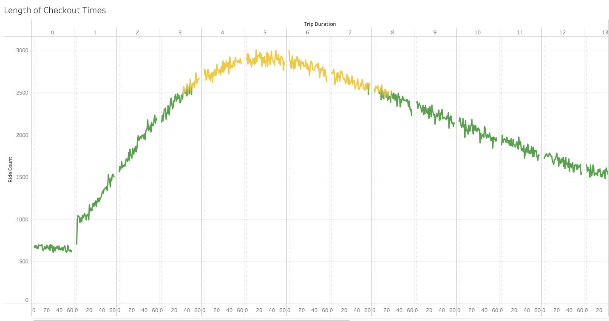
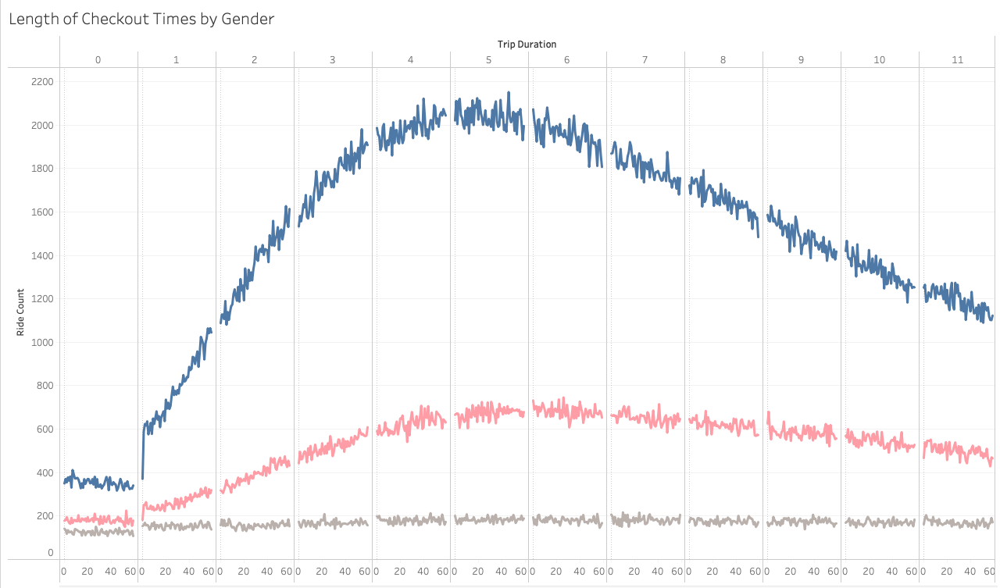
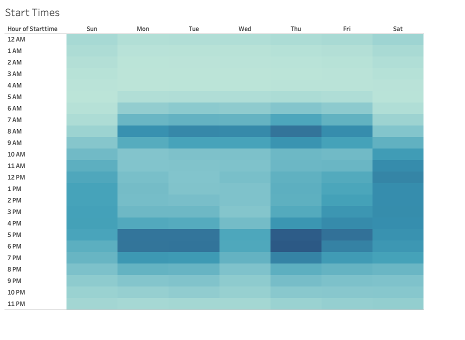
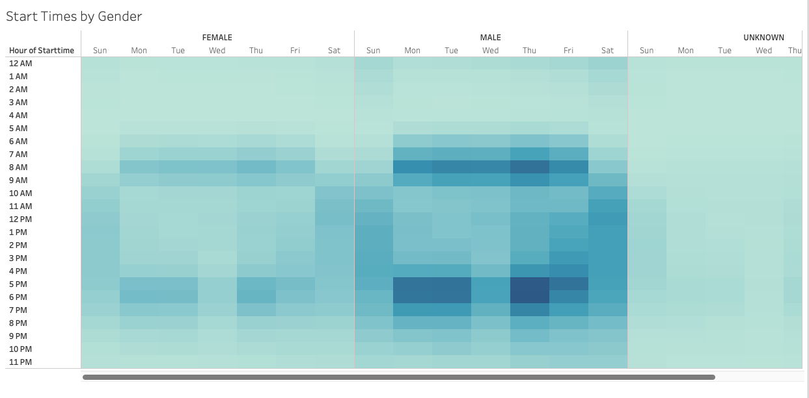
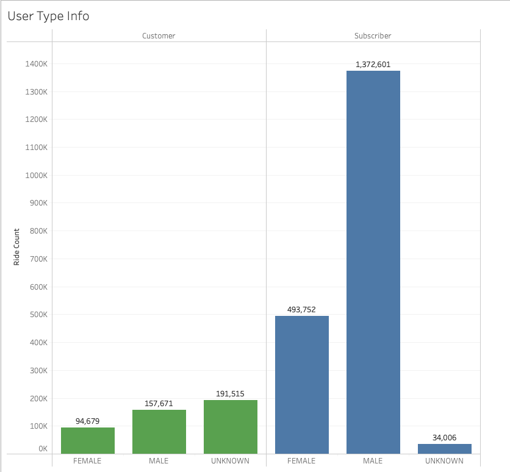
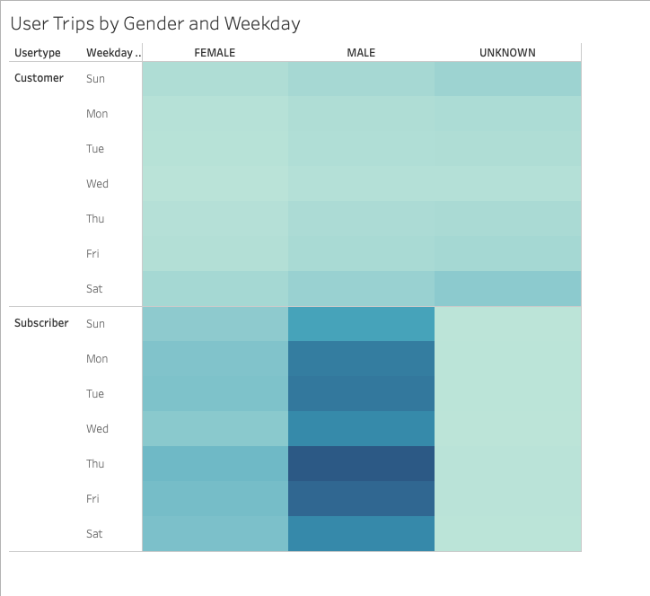
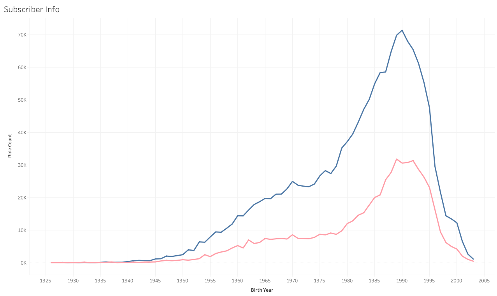

# Bike-sharing

[Link to dashboard](https://public.tableau.com/app/profile/joey.myers2304/viz/NYCCitibikeAnalysis_16497893342050/NYCCitibikeAnalysis)

## Overview
### Purpose
The goal of this project is to present a business proposal for a bike-sharing company. For this project, I used data from the Citi Bike program in New York City.

I analyzed the dataset to visualize the breakdown of rides, rider types, peak hours, etc  in New York City, which will help us predict the customer breakdown in Des Moines and, in turn, propose a business model to investors.

## Results
### Bike Trip Duration
#### Length of Checkout Time

In August in New York City, the most trips fell between 3.5-8.5 hours. The data shows that bike trips under an hour were scarce and riders were not likely to use Citibike for quick trips under an hour.

#### Length of Checkout Time by Gender

There were far more bike trips taken by males than both female and unknown genders. Males and females followed a similar trend where most trip durations were between the 3.5-8 hour range, though. Unknown genders maintained roughly the same amount of trips for all durations.

### Trips Per Weekday
#### Start Times

Monday-Friday, Citibike was most popular around 8 AM and 5-6 PM. This data could suggest that Citibike could be mode of transportation to and from work for city dwellers. Saturday receieved a significant amount of rides throughout mid-morning to late in the evening.

#### Start Times by Gender

Males and females followed a similar pattern of start time popularity, but males simply accounted for more bike trips. 8 AM and 5-6 PM were the most popular time slots for bike trips for males and females. Bike trips from genders that were unknown were most popular throughout the day on Saturday.

### User Types
#### User Type by Gender

Subscribers far outnumbered customers as 81.1% of bike trips were taken from subscribers. Male subscribers accounted for 59% of all bike trips alone. Female subscribers accounted for 22% of all bike trips.

#### User Type Trips by Gender and Weekday

This heatmap shows that the vast majority of bike trips came from male subscribers. Each day this group accounted for the most rides.

#### Subscriber Ride Count by Age and Gender

For subscribers, Citibike popularity increases as birth year increases until 1990 for males and 1992 for females. Mid-20s to early 30s for both men and women contribute the most rides.

## Summary
### Results
These visualizations help identify the type of users that are most and least likely to use Citibike and how to market to each of these groups. Male subscribers in the age range 25-32 formed a large amount of total bike trips in the month of August. Male subscribers were also the most consistent riders throughout the week. 

Bike trips times were most popular just before and immediately following normal work hours during the week and popular throughout the day on Saturday. More research must be done, but ride trip duration data does not support the idea of Citibike being a mode of transportion to and from work. The amount of bike trips with a duration under an hour were very minimal. Des Moines has one of the shortest average commute times in the US, so marketing Citbike as a green and healthy way to commute to work may be fruitful. Most bike trips were from subscribers (repeat users), so that also would prove to be an encouraging sign that Citibike could be adopted by commuters.  

An additional visualizations that would prove to be beneficial would be the count of the aggregated distance of each bike trip. More data would need to be collected for this as I was only given the starting and ending geocoordinates of the bike trips, but even that would give us helpful information. Knowing how far people are riding would provide helpful information for marketing purposes. Another helpful visualization would be average trip duration. This information may give us an idea of what the user is using the bike for (ie. tourism, commute to work).